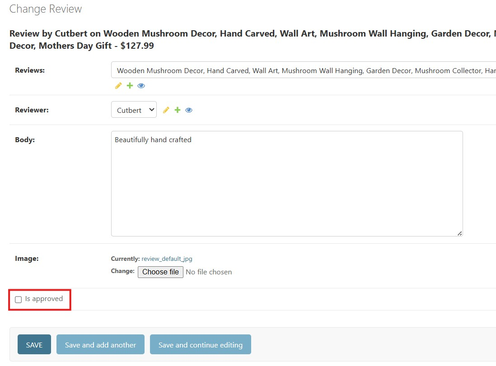
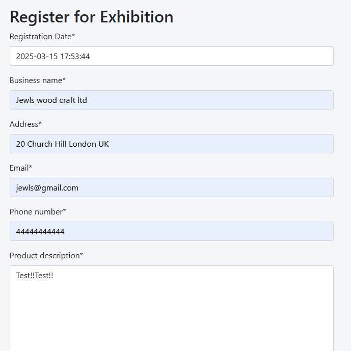
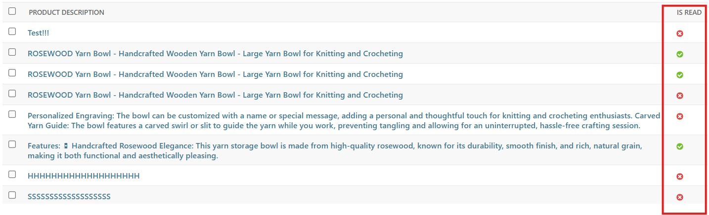
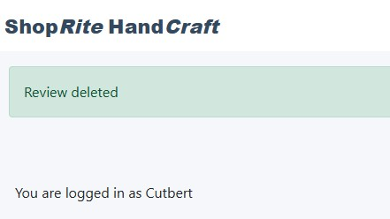
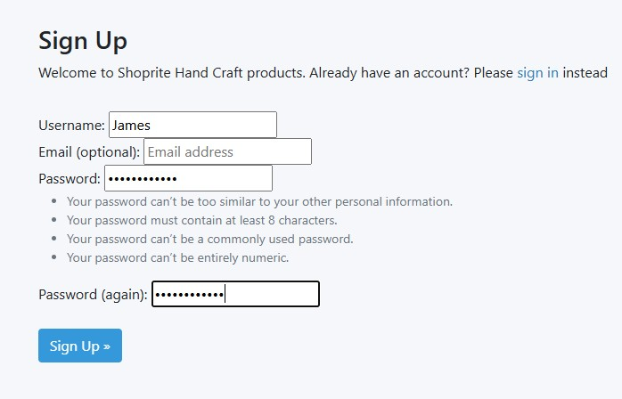
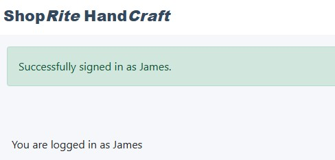

# Local Hand Craft Product Catalogue - Shoperite
## Introduction
This project is for local community craft men to post their hand made products for reviews, improvements and marketing hence, organise exhibitions to market and promote their locally hand made products and businesses.
#### Project Purpose and user Demography
The project is aimed at local community craft men, who uses locally sourced biodegradable materials to produce eco-friendly products. Users can post their products for improvement reviews, market promotion and organise product exhibition for local community. There for promote house hold usage for bio degradable products.
## Design
### Model Entity Relationship Diagram
### Colour Scheme
### Topography
## Features
The core features/functionality of  this project is categorised as below. Future improvements are also highlighted in this section.
#### Navbar
A responsive navigation header where all the links to other html pages are embedded rendered through base.html.

Each navbar item takes you to the desired page.
#### Exhibition page
Details of upcoming exhibition for local craft men (users) to view and register for the event

#### Home page
Displays a paginated  list of products, with marketers/producers name, price of price and date and time posted ready for reviews and promotion

#### Prodct Detail page
Displays a product when clicked from the home page, with product image, price and  descriptions with approved and unapproved reviews.

#### Logout Page
Takes you to a sign out page when clicked with a button to finally signout. 

#### Admin Panel
Page for site owner(super user) to manage products, user reviews and exhibition registrations.

#### Sign Up page
Displays a sign up page were email address is optional, and details the password criteria 

#### Future features Improvement 
Project can be improved by adding ordering page were  site unregistered site users can purchase an item
## Manual Testing
### User Story with Acceptance criteria Features Testing
#### User Story: Site Admin log in

|Key Features|   User Value   |Functionality Test|Outcome|
|:------------|:----------------|:-------------|:------------|
|As a site admin I can login to admin panel|Enable site admin (super user) manage products|Click on login and user super user credentials to log in and append /admin to urls.   |Logged into Django admin panel. |
|As a site admin, I can add products|Enable site admin (super user) to add products for review.|Click on add products, input product details and save.   |Product added to product list. |
|As a site admin, I can delete products|Enable site admin (super user) to delete products.|Click on product change, select product you want to delete, the click delete   |Product deleted from the database, hence not visible to users|
|As a site admin, I can update products|Enable site admin (super user) to update all feilds of product details.|Click on product change, select product you want to update, make the update and save.  |Product Updated|
|As a site admin, I can leave product on draft with out publishing|Enable site admin (super user) to leave products on draft, henece not visible to users until it's published|Select draft on product status. |Product on draft status hence not visible to users for review|
#### User Story: View list of products on home page
|Key Features|   User Value   |Functionality Test|Outcome|
|:------------|:----------------|:-------------|:------------|
|When there are multiple approved products in the database, these products is shown as a list. The user sees a list of products once they open the home page|User views all products on landing page. |Login as a user to view list on products on landing page|View list of products as a user.|
|The user has access to all product names and pagination, to select what to review.|User can view paginated list of products|Login as a user to view list on products on landing page, click next to view more products|More list of product is shown to the user when next is clicked. |
#### User Story: Open product details
|Key Features:|   User Value   |Functionality Test|Outcome|
|:------------|:----------------|:-------------|:------------|
|Site user, click on any product of your choice to view product details|Site user to learn more about the product|Click on a product to render the full product description|Renders full product description when list item is clicked. |
#### User Story: View Reviews
|Key Features:|   User Value   |Functionality Test|Outcome|
|:------------|:----------------|:-------------|:------------|
| Non registered site user can click on a product to read approved reviews|Site user read product reviews left by others to understand more about the product |Click on a product to render the reviews on the product|Renders approved reviews left on the product |
#### User Story: Approve Reviews
|Key Features:|   User Value   |Functionality Test|Outcome|
|:------------|:----------------|:-------------|:------------|
|Logged in super user can approve or disapprove reviews|Super user filter out questionable reviews|Log into admin panel and approve reviews  |Review is_approveed |
#### User Story: Read about up coming Exhibition and register
|Key Features:|   User Value   |Functionality Test|Outcome|
|:------------|:----------------|:-------------|:------------|
|On selecting exhibition link upcoming exhibition details is seen|Read about upcoming exhibition|Click on exhibition link to view exhibition details| Renders upcoming exhibition details  |
|Site user can register for upcoming exhibition|Register to attend exhibition|Fill in the registration form and submit |Form submitted  |
#### User Story: Manage Exhibition registration requests
|Key Features:|   User Value   |Functionality Test|Outcome|
|:------------|:----------------|:-------------|:------------|
|Identify read and unread exhibition registration request|Site admin can see how many left to process|Log into admin panel, read rigistration and check is_read|View read and unread exhibition registration  |
#### User Story: Update or Delete review of a product
|Key Features:|   User Value   |Functionality Test|Outcome|
|:------------|:----------------|:-------------|:------------|
|Logged in user can update their review|Enable user to edit their review|Click edit on the review you want to edit, update and click update to submit  |Updated review is submitted |
|Logged in user can delete their review|Enable user to delete|Click delete, then click the modal delete |Review deleted |
#### User Story: SignUp
|Key Features:|   User Value   |Functionality Test|Outcome|
|:------------|:----------------|:-------------|:------------|
|Site user can signup with username and password|Enable user to review products|Click on Signup, provide username and password then signup |Successfully signed up |

### Features Test Result Compilation
|Key Features|   Test Case  |Outcome|
|:------------|:----------------|:-------------|
### Lighthouse Performance
|View Tested|   Outcome of the audit  |Soulution Applied|Screenshot of clear Validator output|
|:------------|:----------------|:-------------|:------------|
### Validation Testing
|Page Tested|Screenshot of Errors and Warnings   |Solution Applied|Screenshot of clear Validation Output|
|:------------|:----------------|:-------------|:------------|
### Browser compatibility
|Browser Tested|Functionality Tested|Visual Consistency|Outcome|
|:------------:|:----------------:|:-------------:|:-------------:|
|Browser Tested|Intended Appearance|Intended Responsiveness|
|:------------:|:----------------:|:-------------:|
### Screen sizes Responsiveness  
|Device Tested|Site responsive >=700px |Site responsive <699px|Render as expected|
|:------------:|:----------------:|:-------------:|:--------------:|
### Pages Responsivnes
|Home Page|Register Page|Gallery Page|About Us Page|Donation Page|Thank you Page|
|:------------:|:----------------:|:-------------:|:--------------:|:--------:|
### Accessibility
|Color Contrats Testing|Alternative Text for Images |Outcome|
|:------------|:------------------|:---------------:|
## Technologies Used
### Languages Used
## Bugs
#### Bugs Resolved
|Bug|   Description |Solution Applied|Result|
|:------------|:----------------|:-------------|:------------|
#### Bugs Unresolved
|Bug|   Description |Solution Applied|Result|
|:------------|:----------------|:-------------|:------------|
### Libraries
## Deployment
## Credits
### Codes
### Tutorials
### Text Content